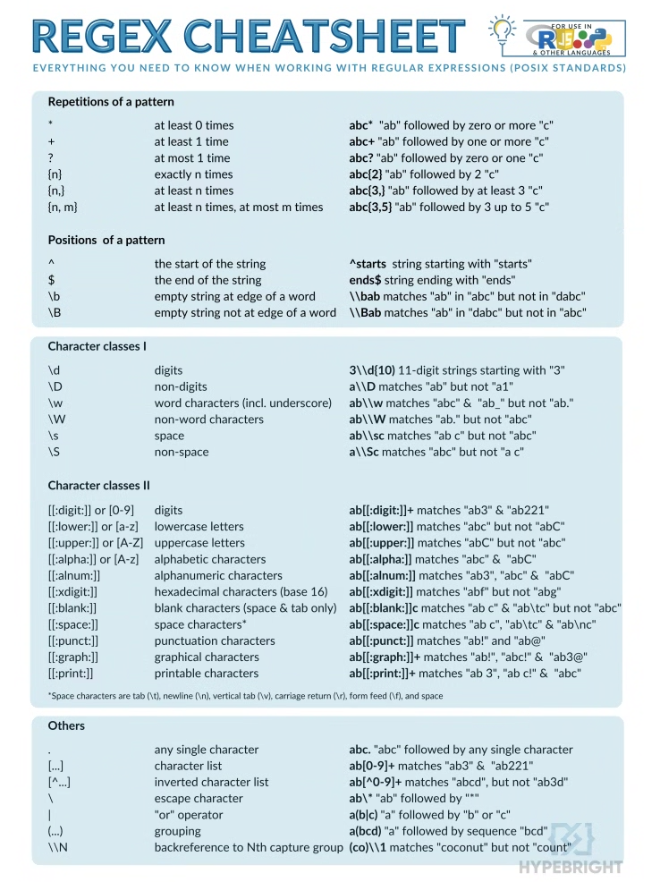

```{r setup, include=FALSE}
knitr::opts_chunk$set(echo = TRUE)
```

```{r}

# 
# packages_to_install <- c('tidyverse', 'ggplot2', 'lme4') # main ones
# install.packages(packages_to_install)
# 
# optional_package<- c('heplots','ggeffects','ggpubr','visreg', 'lattice', 'psych', '')
# install.packages(optional_package)

```

## R Markdown

This is an R Markdown document. Markdown is a simple formatting syntax for authoring HTML, PDF, and MS Word documents. For more details on using R Markdown see <http://rmarkdown.rstudio.com>.

When you click the **Knit** button a document will be generated that includes both content as well as the output of any embedded R code chunks within the document. You can embed an R code chunk along text.

# see this book for R introduction aimed at psychologists - https://alexander-pastukhov.github.io/data-analysis-using-r-for-psychology/software.html 

# Introduction
This is a R markdown, it is like a jupyter notebook or matlab live-script. It can incorporate blocks of text with blocks of R-script. 

The schedule is to first introduce common data types and variables, followed by functions and libraries for plotting. Afterwards we would apply typical analyses like anovas and mixed effect models to tutorial datasets. We will conclude by showing how to plot results of this data, as well as simulate data for instance for power testing.


# 1. Data Types and Structures

This can be used as a cheat sheet, but the main thing to remember is that functions would act differently depending on data types, so it is important to know what datatypes you have in to the data.


```{r}
# Basic types
num <- 42 # number can be double
char <- "hello" # string
bool <- TRUE # logical variable that you can use as a condition or for filtering

# Vectors
vec <- c(1, 2, 3, 4)
vec[1]
vec[0]
vec[5]
# Named vector
(vec <- c('height'=2, 'weight'=3, 'gender'=0))
vec['height']
names(vec) <- c('H','W','G')
vec


# Lists - can hold different types of variables, e.g., list of vectors, lists, or dataframes. can be useful when saving a json file.
lst <- list(name="Boris Johnson", age=54, scores=c(88, 90, 95))

# Matrices
mat <- matrix(1:9, nrow=3)

# Data Frames
student_data <- data.frame(
  name = c("Ayse", "Ali", "Ece"),
  score = c(90, 85, 88)
)
```

```{r}
(vec <- c(1:10))

vec[1]
vec[0]
vec[20]
# Named vector
(vec <- c('height'=2, 'weight'=3, 'gender'=0))
vec['height']
names(vec) <- c('H','W','G')
vec
vec[2]
vec[[2]]
# read this for more detailed explanation - https://alexander-pastukhov.github.io/data-analysis-using-r-for-psychology/tables.html


(vec <- c(1:10))
vec[c(1,2,3)]
vec[c(1,1,1,1,1,2,3)]
vec[c(-1,-2,-3)] # all but 1st 2nd, 3rd 

5:2
seq(5,2,by=-1)

## you can add vectors, but weirdly you don't get an error if there are not of different length

# Unfortunately, R has a solution and that is not an error or a warning. Rather, if the length of the longer vector is a multiple of the shorter vector length, the shorter vector is “recycled” , i.e., repeated N-times (where N = length (longer vector) / length (shorter vector) )

x <- 1:6
y <- c(2, 3)
print(x + y)


```


Variables can be useful e.g., when we want to iterate or apply a function to each element in a vector or organised data into a data frame. You can perform simple arithmetic operations on variables, which can be useful when you want to do something not available in a package.

```{r}

a = 5
b = 2

print(a+b)
print(a*b)

print(paste('a to the power of b',a^b))
print(paste('string one', 'string two')) # our first use of a function, paste can concatenate strings, by default separated by space

# note that paste converted the number a^b to a character
# you could often convert simple variables in format, which may be useful later on
print(a)
print(as.character(a))

TEMP <- "51"
print(TEMP)
print(as.numeric(TEMP))

correct <- 1
print(correct)
print(as.logical(correct))

## you can provide two vectors of sample length to paste and it will concatenate them accordingly
(nth <- paste(1:12)) # outer brackets are a short hand for print - function
(nth<- paste(1:12, c("st", "nd", "rd", rep("th",9)))) # ok but we do not want space between the two strings, so we can give the function an argument to do this first lets check the help menu ?paste - this would often show arguments for a function, we see something called sep - which controls the separation between strings

(nth<- paste(1:12, c("st", "nd", "rd", rep("th",9)), sep="")) # in R sometimes there are short hands for commonly used functions, e.g., paste0 takes the default value of sep="", so
(nth<- paste0(1:12, c("st", "nd", "rd", rep("th",9))))

```
Working with strings can be particularly useful when we want to deal with file names, but before I show that I want to mention some simple functions that can be particularly helpful when combining variables together
We already saw one of these functions - rep
```{r}
(rep(1,2)) # this can repeat a variable multiple times, so for example if we had a vector of 1s (males) and 0s (females) we could repeat it to match our data. Lets say we have data from 10 males and 10 females

(rep(c(1,0),10)) # a but this repeated the whole vector 10 times, maybe we have first the 10  males and later 10 females

(rep(c(1,0),each=10)) # ok and what if now we collect another 20 people in same order
(temp_gender <- rep(c(1,0),each=10,times=2)) 

# rep works also with factors or strings
gender <-c("male","female")
(rep(gender, each=10))

gender_factor <-factor(temp_gender, levels = c(1,0), labels = c("male","female"))

summary(gender_factor)
unclass(gender_factor)
```

Now that we have a vector temp_gender we may want to manipulate it. We can change it with maths or with logical indexing - this is the most time-consuming bits often in research is clearning and organising the data.
I will first show the most common opperations with basic R since that would be most similar to other programming languages like python and matlab. I will then try and show some short hands that can make things a bit easier to code but achieve the same 
Because we have a vector we can either do an operation to every element in the vector or what most often we want is to do some operations for some elements and another operation for other elements. For instance, we may want to recode our variables to be -1 for males and 1 for females.

```{r}

temp_gender_new <- numeric(length(temp_gender))

# we can interate over numbers
for (i in 1:5 ) {
  print(i)
}

# we can assign conditions to do something only when a condition is met - here when the i is odd rather than even
for (i in 1:5 ) {
  if (i %% 2){
    print(i)
  }
}


# Loop through each element in temp_gender
for (i in seq_along(temp_gender)) {
  if (temp_gender[i] == 0) {
    temp_gender_new[i] <- -1  # if value is 0, assign -1
  } else {
    temp_gender_new[i] <- 1   # otherwise, assign 1
  }
}

(rbind(temp_gender,temp_gender_new)) # stack rows
### ok you might be wondering if there is a short hand as this is something likely we would have to do quite often and there is
temp_gender_new <- ifelse(temp_gender == 0, -1 , 1) # what this does is if temp_gender variable is equal to 0 we make it -1 otherwise we code everything else as 1

# although we did this with for loops and if conditions, for this specific situation the easiest may be a simple arithmetic solution - multiplication by scaler performs the operation on each element
temp_gender_recode <- temp_gender*2 - 1
(rbind(temp_gender, temp_gender_new, temp_gender_recode))
```

As you can see there multiple ways to achieve the same goal, this is very common in programming, especially in open software where different people might have created different packages that do basically the same thing. It can be tricky as sometimes the packages appear to do the same things but there are subtle differences, often this is easier to detect when re-formating data, but may be more subtle when working with statistical packages e.g., that calcualte effect size or marignal means. But for now back on task, we now know the basics of programming that we would need in most psychology situations. We know how to iterate over things and provide conditions, what we do not know is how to write our own functions.


```{r}
# often there would be some pre-made function that does what you need, but sometimes it may be useful to use a function to wrap around a piece of code you use often
# we I simply show the syntax of a very simple function, but later on the workshop we will use a bit more useful one.
# main points are we can define something we pass it arguments, (x,y), you make some computation and return the output.
add_two_numbers <- function(x=1, y=1) {
  result <- x + y
  return(result)
}
print(add_two_numbers())
print(add_two_numbers(x=5, y =10))


```

Ok after seeing some basics of programming it may be a good time to actually start doing some things we might encounter in the real world. I in my opinion doing something is the best way to learn, you should not be too scared of making mistakes and the syntax is something internet or chatGPT can help you with. There are extensive resources online to introduction to R showing how to use different datatypes, vectors and functions, here I have listed some of them.

Most famous ones are the Navarro R book - https://learningstatisticswithr.com/ 
For people with no experience with R - https://bookdown.org/rdpeng/rprogdatascience/ 

https://intro2r.com/ 
https://www.w3schools.com/r/r_intro.asp 
https://r4ds.had.co.nz/index.html 
https://rpubs.com/ruruu127/417821 
https://alexander-pastukhov.github.io/data-analysis-using-r-for-psychology/index.html - Aimed at Psychologists


tidyverse is a package in R that has gained popularity, it is effectively a short handed way to achieve what you can do also with base R with more code. Some people love it, some people hate it. My opinion is that base R is more similar to other languages so it may be easier to read. The "speed" you gain from running things in tidyverse is unlikely to be important for most psychologists. It can act a bit too much as a black box when you are learning things.
However, it can be easier sometimes for plotting and data-wrangling. I will try and focus on base R in this tutorial but will try an include tidyverse alternatives to give an introduction to it as well. One thing to note is that many packages may have functions, operators (e.g., *, %>%) that are named the same so they can interact. This means when using multiple packages one has to be slighly careful and expect sometimes errors.

https://www.tidyverse.org/learn/ 
https://bookdown.org/yih_huynh/Guide-to-R-Book/tidyverse.html 

However, reading too much into "theory" may not be useful, as quite likely one will forget exactly what command performed a certain operation unless they do it repeatedly. 

```{r}
# Number of subjects
n_subjects <- 20

# Loop over subject numbers
for (i in 1:n_subjects) {
  
  # Create a subject ID like "sub-01"
  sub_id <- sprintf("sub-%02d", i)
  
  # Create a folder for the subject
  dir.create(sub_id, showWarnings = FALSE)
  
  # Create a simple data frame (optional content)
  demo_data <- data.frame(
    subject = sub_id,
    age = sample(18:65, 1),
    condition = sample(c("control", "treatment"), 1)
  )
  
  # Define file path: sub-01/sub-01.csv
  file_path <- file.path(sub_id, paste0(sub_id, ".csv"))
  
  # Write the CSV file
  write.csv(demo_data, file = file_path, row.names = FALSE)
}

```


```{r}
main_dir <- (".")

subject_folders <- list.dirs(main_dir, full.names = TRUE, recursive = FALSE) # or better yet to use a pattern
# from grep can use regular expressions
folder_list <- gsub("\\./", "",subject_folders)
## alternatively
(subject_folders <- list.files(main_dir, full.names = TRUE, recursive = FALSE, pattern="sub")) # or better yet to use a pattern

all_data_list <- list()


# Loop through each subject folder
for (folder in subject_folders) {
  
  # Find CSV files in that folder
  csv_files <- list.files(folder, pattern ="^sub-\\d{2}\\.csv$", full.names = TRUE) # - "\\.csv$" - find any csv file; - find csv file that matches pattern sub-{2 numbers}.csv
  
  # Only proceed if at least one CSV is found
  if (length(csv_files) > 0) {
    
    # (Assume the first one is the subject CSV)
    csv_path <- csv_files[1]
    
    # Read it
    df <- read.csv(csv_path)
    
    # Add subject info from folder name
    df$subject <- basename(folder)
    
    # Append to list
    all_data_list[[basename(folder)]] <- df
    
  } else {
    warning(paste("No CSV found in", folder))
  }
}

# Combine all into one data frame
combined_data <- do.call(rbind, all_data_list)

# Show result
head(combined_data)

```




Can we achieve the same with less code?

```{r}

library(tidyverse)

main_dir <- "."

# Get all subject folders that start with "sub-"
subject_dirs <- list.dirs(main_dir, recursive = FALSE) %>%
  keep(~ str_detect(basename(.x), "^sub-\\d+"))

# temp_name <- list.dirs(main_dir, recursive = FALSE) 
#k eep(temp_name, ~ str_detect(basename(.x), "^sub-\\d+"))

# Read and combine the first .csv file from each subject folder
combined_data <- subject_dirs %>%
  map_dfr(function(folder) {
    csv_file <- list.files(folder, pattern = "\\.csv$", full.names = TRUE)[1]
    if (!is.na(csv_file) && file.exists(csv_file)) {
      read_csv(csv_file) %>%
        mutate(subject = basename(folder))
    }
  })

head(combined_data)
```


We achieved the same goal with less code, but there are a lot of things going on that may be difficult to follow so I will provide a bit more general introduction to tidyverse here
The basic idea of the package is to apply functions to elements of data.frames more easily and automatically, without us having to do the for loops 
Lets re-start a new data so we can show some of the functionality of tidyverse - which is a large collection of packages most common being ggplot and dplyr - they can be installed separately if you have issues with install.packages("tidyverse")

We will demonstrate some of the main features and plotting using the iris dataset
iris is a tidy dataset. Each row is an observation of an individual iris, each column is a different variable.
This can be thought of as long form data (foreshadowing)  - Basic idea is that each row might be a trial from experimental paradigm, or a subject, and each column could be a variable, e.g., Condition, Reaction Time, Age, Gender, etc.
This format of storing data is very common throughout statistics and is not really specific to R


--- see  readxl  for reading excel data e.g., read_excel("my_excel_file.xls", sheet=2) / read_excel("my_excel_file.xls", sheet="addendum")
--- saveRDS and readRDS can be used when you want to save a vector or R object that is not a csv
```{r}
print(dim(iris))
head(iris)
print(class(iris))
colnames(iris)
glimpse(iris)
str(iris)

summary(iris)

# this is a cheat to call a function from a package without loading the full package
psych::describe(iris)

```
# Conditional operators - 

# == equal
# <= less or equal
# >= more or equal
# & - and 
# OR

```{r}
# One can grab data from specific rows or columns but simply indexing the data e.g., 2nd row 3rd column
iris[2,3]
iris$Sepal.Length # grab whole column
iris['Sepal.Length']
iris[['Sepal.Length']]
(iris[,1]) # grab whole column but use numeric index
head(iris[,-1]) # grab all columns but first one
iris[iris$Species == "setosa", ] # grab all columns but focus on rows that are from the setosa species
(iris[iris$Species == "setosa" | iris$Species == "virginica", ])


# Often we would have some missing values that we have to find
iris_copy <- iris
make_missing <- sample(c(1,0),size = nrow(iris_copy), prob = c(0.10,0.90), replace = TRUE) # this samples 1, and 0 with replacement and says 1 has 90% chance of occurring and 0 - 10% chance of occurring 
iris_copy$Sepal.Length[as.logical(make_missing)] <- NA
(missing_values <- is.na(iris_copy$Sepal.Length))
print(sum(missing_values)/nrow(iris_copy))

# ok what is the mean length
mean(iris$Sepal.Length, na.rm = TRUE) # na.rm means ignore nan values
mean(iris$Sepal.Length[iris$Species == "setosa"], na.rm = TRUE)
mean(iris[iris$Species == "setosa", "Petal.Length"], na.rm = TRUE)


## ok but we can also achieve this with piping which is very common in the tidyverse
# piping is a common programming trick where we feed the result of one operation into another
iris$Sepal.Length %>% mean()

# This may look pointless but it can be quite helpful when you want to perform multiple functions together
# lets say we have repeats we may want to calculate the mean of unique values

mean(unique(iris$Sepal.Length))

iris$Sepal.Length %>% unique() %>% mean() %>% round(digits=3)

## %>%  - can be done with ctrl + shift + m / or command + shift + m

# z <- 4
# w <- 3
# z %>% radius(w) # is the same as radius(z,w) - piped output is first argument
# z %>% radius(x = w, y = .) # is radius(w,z) - you can use the dot to specify place for piped output
## remember this

## subject_dirs <- list.dirs(main_dir, recursive = FALSE) %>%
##  keep(~ str_detect(basename(.x), "^sub-\\d+"))

# we are feeding the results of list.dirs the subject folders to another function that will apply operations to each element, but we are getting ahead of ourselves

```

Lets do some data wrangling - see https://rpubs.com/Earlien/Wrangling 
dplyr is a package that makes part of the larger tidyverse. dplyr is a grammar of data manipulation, providing a consistent set of verbs that help you solve the most common data manipulation challenges. - https://dplyr.tidyverse.org/
As you can imagine base R can do everything that tidyverse can, but it can become a bit hairy when we want basic data operations that are common
```{r}
library(dplyr)
# lets say we may want to select only certain columns - select is a good way to do this

iris_select <- iris %>% select(Species, Petal.Length, Petal.Width)
head(iris_select)

# ok but what if we do not want to list all the names e.g., imagine you have more than 20 columns - you can use some helper functions

iris_select <- iris %>% select(Species, matches("Width")) # any coulmn that contains Width
head(iris_select)

iris_select <- iris %>% select(Species, contains("Sepal")) # any coulmn that contains Width
head(iris_select)

iris_select <- iris %>% select(Species, starts_with("Petal")) 
head(iris_select)

iris_select <- iris %>% select(Species, ends_with("Length")) 
head(iris_select)
iris %>% select(matches("[A-Z]\\."))# any column that has capital letter followed by a dot 


```
Ok we can select columns cool, can we do something with them - yes with mutate which allows one to create new columns or operate on columns based on values of other columns

```{r}
iris_select <- iris %>% 
  select(Species, Petal.Length, Petal.Width) %>% 
  mutate(Times.Bigger = (Petal.Length/Petal.Width)) # Create new column, set = to condition/function

iris_select <- iris %>% 
  select(Species, Petal.Length, Petal.Width) %>% 
  mutate(Times.Bigger = (Petal.Length/Petal.Width),
         Log.Length = log(Petal.Length+1))
head(iris_select)

# BASE R equivalent
iris_copy <- iris
iris_copy$Time.Bigger = iris_copy$Petal.Length / iris_copy$Petal.Width
head(iris_copy)

```
How can we work on specific values - filter, we can condition on column values, e.g., grab only setosa species or only species above certain length
```{r}

setosa_small <- iris %>%         # create from iris dataset
  filter(Species == "setosa" & Sepal.Length < 5) # filter for species name and sepal length under 5

filter(iris, Petal.Length > 6 & Sepal.Length > 7)

head(setosa_small) # view the new dataset


# we can actually combine the filter with mutate which is often usefule

iris_flagged <- iris %>% mutate(TallPlants = Sepal.Length > 5.8 | Petal.Length > 3.5)
head(iris_flagged %>% filter(Sepal.Length > 5.8 | Petal.Length > 3.5))
# One can use case_when to have not simply TRUE, FALSE values which can be useful when creating new variables
# case when is like a vectorised if_else statements


iris_flagged <- iris %>% mutate(TallPlants = 
                                  case_when(Sepal.Length > 5.8 | Petal.Length > 3.5 ~ "Tall",
                                            TRUE ~ "Short"))

## case_when can be used with multiple conditions and can be thought of as 
# if (condition) {
# do x
#} else { do y}

iris_flagged <- iris %>% mutate(TallPlants = 
                                  case_when(Sepal.Length > 5.8 | Petal.Length > 3.5 ~ "Tall",
                                            Sepal.Length < 5.8 & Sepal.Length > 5 ~ "Medium",
                                            TRUE ~ "Short"))

```

summrise is similar to psych::describe() we saw above
in basic r you can use aggregate 
the basic idea is you can create a new dataframe/ tibble that describes the data, although with the current data this may not appear very useful, it can be very helpful when you have multi-level data, e.g., multile trials, from multiple subjects, we will see this later on
in its simplest form it just provides the mean of a column
```{r}

iris %>% summarise(mean(Sepal.Width))
iris %>% summarise(mean(Sepal.Width), n = n()) # how many observations 
iris %>% summarise(mean(Sepal.Width), max(Sepal.Width), median(Sepal.Width),n = n())

# base R similar way
aggregate(Sepal.Width~1, data = iris,mean)
agg_Df<- aggregate(Sepal.Width~1, data = iris,FUN = function(x) c(mean = mean(x), sd = sd(x)))
head(agg_Df)
# some people use apply which applies a function to each element of data.frame - apply(iris[,1:4],2,mean) # 2 specifies that it should be applied over columns

# a benefit of summarise is that we can use group_by to calculate descripives per group
#The group_by() function allows us to break up our dataset by a specific value. Above we wanted to see the mean, max, and min values of sepa width by species. We can use group_by(Species) for this to work.

iris %>%  group_by(Species) %>% summarise(mean(Sepal.Width), max(Sepal.Width), median(Sepal.Width),n = n())

# we can also arrange data
# 
# arrange() allows us to rearrange our data based on certain conditions. Let’s create a new dataset called virginica that contains only the virginica species, has sepal widths greater than 2.9, and is arranged in descending sepal lengths (we will use the desc() function).
# 
# NOTE: desc() stands for descending. It will places the rows in descending order.

iris_new <- iris %>% # call from iris data
  filter(Species == "virginica" & Sepal.Width > 2.9) %>% # filter species and sepal width
  arrange(desc(Sepal.Length)) # arrange the data by descending values in sepal length

iris_new # view the new data frame
```

```{r}
psych::describeBy(iris, group="Species")

```
We often want to rename columns - rename / rename_with; or if we want to change the names of values within column - recode

```{r}
print(names(iris_flagged))
iris_flagged = iris_flagged %>% rename(Height := TallPlants)
print(names(iris_flagged))


iris %>%
    rename_with(~ tolower(gsub("\\.", "_", .x)), .cols = everything())

#  function(.x) {
#   tolower(gsub("\\.", "_", .x))
# }

# with ~ we are creating a function but not asigning it to a variable - another short hand
# https://coolbutuseless.github.io/2019/03/13/anonymous-functions-in-r-part-1/


# NOTE although the original data had name Species, now because of tolower we use species
iris_clean = iris %>%
    rename_with(~ tolower(gsub("\\.", "_", .x)), .cols = everything()) %>% 
    mutate(species_new = recode(species, 
                                "setosa" = "A",
                                "versicolor" = "B",
                                "virginica"= "C"))

head(iris_clean)


```
# simple visualisations
```{r}
plot(iris) # not pretty but quick it can quickly select the plot you might want e.g., here does pairs plot or a scatter plot for each pair of variables

hist(iris$Sepal.Length)
boxplot(iris$Sepal.Length ~ iris$Species) # first y axis then x axis  # can check for outliers

# lattice::dotplot(iris$Sepal.Length ~ iris$Species)
plot(iris$Sepal.Length ~ iris$Sepal.Width)

```
Visualization - the plotting can be done with basic plots but most people use the ggplot library which can create a bit prettier plots

"ggplot2 is designed to work iteratively. You start with a layer that shows the raw data. Then you add layers of annotations and statistical summaries. This allows you to produce graphics using the same structured thinking that you would use to design an analysis. This reduces the distance between the plot in your head and the one on the page. This is especially helpful for students who have not yet developed the structured approach to analysis used by experts."

ggplot2 book - https://ggplot2-book.org/getting-started.html 

A plot in ggplot2 is described in three parts:

Aesthetics: Relationship between data and visual properties that define working space of the plot (which variables map on individual axes, color, size, fill, etc.).
Geometrical primitives that visualize your data (points, lines, error bars, etc.) that are added to the plot.
Other properties of the plot (scaling of axes, labels, annotations, etc.) that are added to the plot.


Every ggplot2 plot has three key components:

data,

A set of aesthetic mappings between variables in the data and visual properties, and

At least one layer which describes how to render each observation. Layers are usually created with a geom function.

ggplot2 Main Logic
ggplot2 follows a layered grammar of graphics:

Start with data + aesthetics:
ggplot(data, aes(x = ..., y = ...))

Add geoms (visual elements):
+ geom_point(), geom_line(), geom_bar()
Map additional aesthetics (color, shape, size):

+ aes(color = ..., shape = ...)
Customize scales and labels:

+ scale_color_manual(), labs(), theme_minimal()

Think of it as building a plot step-by-step, like layers on a cake.


```{r, fig.width=15}
library(ggplot2)
library(patchwork)
ggplot(data = iris, aes(x = Sepal.Width, y = Sepal.Length, col = Species)) + geom_point()
# notice how the data argument is not needed
# iris %>% ggplot(aes(x = Sepal.Width, y = Sepal.Length, col = Species)) + geom_point()


ggplot(iris, aes(x = Petal.Length, y = Petal.Width, col=Species)) +
  geom_point() +
  # a linear regression over all dots in the group
  geom_smooth(method="lm", formula = y ~ x, se=TRUE, linetype="dashed") 


ggplot(iris, aes(x = Petal.Length, y = Petal.Width, col=Species)) +
  geom_point() +
  # Group-specific regressions
  geom_smooth(method = "lm", formula = y ~ x, se=TRUE, linetype="dashed") +
  # Global regression overlay
  geom_smooth(
    aes(group = 1),     # 👈 tells ggplot to treat all data as one group
    method = "lm",
    formula = y ~ x,
    se = TRUE,
    color = "black",    # make it stand out (or whatever color you want)
    linewidth = 1.2,
    linetype = "solid"  # solid line for global fit
  )


## what if we want each Species to be a separate plot

ggplot(iris, aes(x = Petal.Length, y = Petal.Width, col=Species)) +
  geom_point() +
  geom_smooth(
    method = "lm",
    formula = y ~ x,
    se = TRUE,
  ) + facet_grid(. ~ Species)  + # makes a separate subplot for each group
  theme(legend.position = "none") # we don't need the legend as conditions are split between facets 

# Grab default ggplot colors and apply alpha
# default_colors <- scales::hue_pal()(3)  # get 3 default colors
# transparent_colors <- alpha(default_colors, 0.5)
# 
# ggplot(iris, aes(x = Petal.Length, y = Petal.Width, color = Species)) +
#   geom_point() +
#   geom_smooth(method = "lm", formula = y ~ x, se = FALSE, linetype = "dashed") +
#   scale_color_manual(values = transparent_colors) +
#   theme_minimal()

```

Often we need more than lines on a grid, so how do we change labels or specify certain colors for groups of variables
```{r}

iris_flagged <- iris %>% mutate(TallPlants = 
                                  case_when(Sepal.Length > 5.8 | Petal.Length > 3.5 ~ "Tall",
                                            Sepal.Length < 5.8 & Sepal.Length > 5 ~ "Medium",
                                            TRUE ~ "Short"))


ggplot(iris_flagged, aes(x = Petal.Length, y = Petal.Width)) +
  geom_point(aes(color = TallPlants, shape = TallPlants), size = 3) +
  labs(
    title = "Iris: Tall, Medium, and Short Plants",
    x = "Petal Length",
    y = "Petal Width",
    color = "Plant Height",
    shape = "Plant Height"
  ) +
  theme_minimal()


ggplot(iris_flagged, aes(x = Petal.Length, y = Petal.Width)) +
  geom_point(aes(color = TallPlants, shape = TallPlants), size = 3) + scale_color_manual(values = c("Tall" = "red", "Medium" = "orange", "Short" = "gray")) +
  labs(
    title = "Iris: Tall, Medium, and Short Plants",
    x = "Petal Length",
    y = "Petal Width",
    color = "Plant Height",
    shape = "Plant Height"
  ) +
  theme_minimal()


```

```{r}
iris %>% ggplot(aes(x= Petal.Length, y = Petal.Width)) +geom_point(color="blue") 

iris %>% ggplot(aes(Petal.Length)) + geom_histogram() + theme_minimal() # lets remove the annoying grid

P<- iris %>% ggplot(aes(Petal.Length)) + geom_histogram(fill="skyblue", color = "black", bins = 30) + theme_minimal() +
  theme(panel.grid.major = element_blank(), panel.grid.minor = element_blank()) + # lets remove the annoying grid
  theme(text = element_text(size = 14)) + # increase the text size
  labs(title = "Distribution of Petal Length in Iris Dataset", 
       x = "Petal Length (cm)",
    y = "Count")

P
ggsave('./Histogram_Petal_Length.png', P, width = 15, height = 8, dpi = 300)


## ok but often we might want more control over text elements

iris %>% ggplot(aes(Petal.Length)) + geom_histogram(fill="skyblue", color = "black", bins = 30) + theme_minimal() +
  theme(panel.grid.major = element_blank(), panel.grid.minor = element_blank()) + # lets remove the annoying grid
    theme(
    plot.title = element_text(size = 20, face = "bold", hjust = 0.5), # center title and make it bold and tell it explicitly what size it should be
    axis.title.x = element_text(size = 14), # xlabel
    axis.title.y = element_text(size = 18), # ylabel
    axis.text.y = element_text(size = 12), # yticklabels
    axis.text.x = element_text(size = 10), # xticklabels
    text = element_text(family = "serif")  # applies to all labels by default
  ) +
  labs(title = "Distribution of Petal Length in Iris Dataset", 
       x = "Petal Length (cm)",
    y = "Count")


## Use above theme object to manipulate your figures as you wish

## what if we want to examine histogram grouped by species
iris %>% ggplot(aes(Petal.Length, fill = Species)) + geom_histogram()


```
https://rstudio.github.io/cheatsheets/html/data-visualization.html 

# selection of GGPLOTs - http://r-statistics.co/Top50-Ggplot2-Visualizations-MasterList-R-Code.html 
# GGPLOT book - https://ggplot2-book.org/

```{r, fig.width=15,fig.height=15}
library(ggExtra)
g<- ggplot(iris, aes(x = Petal.Length, y = Petal.Width)) +
  geom_point() +
  # a linear regression over all dots in the group
  geom_smooth(method="lm", formula = y ~ x, se=TRUE, linetype="dashed") 

ggMarginal(g, type = "histogram", fill="transparent")


library(corrplot)

iris %>% select(where(is.numeric)) %>% cor() %>% corrplot(, type='lower',diag = FALSE, method='number', col = colorRampPalette(c("blue", "white", "red"))(200))
library(GGally)
iris %>% select(where(is.numeric)) %>%   rename(
    S_length = Sepal.Length,
    S_width = Sepal.Width,
    P_length = Petal.Length,
    P_width = Petal.Width
  )%>% ggpairs( lower = list(continuous = "points", combo = "dot_no_facet"),progress=FALSE,title='Iris') + theme_classic(base_size=15)


# Keep Species for mapping but exclude from actual pairs
iris_data <- iris %>%
  select(Species, where(is.numeric)) %>%
  rename(
    S_length = Sepal.Length,
    S_width = Sepal.Width,
    P_length = Petal.Length,
    P_width = Petal.Width
  ) 

ggpairs( iris_data,
  columns = 2:5,  # 👈 skip the first column (Species)
  mapping = aes(color = Species),
  lower = list(continuous = "points", combo = "dot_no_facet"),
  progress = FALSE,
  title = "Iris"
) +
  theme_classic(base_size = 15)


```


Ok it is unlikely one would master all data-wrangling needed - ever, because each project would require a different set of options, Google and chatGPT is your friend. Often you can do everything in base R or tidyverse equally well it is just a style preference. Just like learning a normal language, it does not make sense to learn the vocabulary if you do not have anything to say, so the best way to learn is to start using the skills to analyse data

the simplest thing we can do is do a t-test, lets compare the petal length of the setosa and virginica


```{r}

iris_t_Test_data <- iris %>% select(Species,Petal.Length) %>% filter(Species %in% c('setosa', 'virginica'))

#
t.test(Petal.Length ~ Species, data= iris_t_Test_data, var.equal=TRUE)# note 
var.test(Petal.Length ~ Species, data= iris_t_Test_data, var.equal=TRUE)# note 


ggplot(data = iris_t_Test_data, aes(x= Species, y = Petal.Length)) + geom_boxplot() + theme_minimal()
ggplot(data = iris_t_Test_data, aes(x= Petal.Length, fill = Species)) + geom_histogram() + theme_minimal()

model_linear <- lm(Petal.Length ~ Species, data= iris_t_Test_data)
summary(model_linear)

```
# What if we want to compare all species
anova in base R - https://bookdown.org/steve_midway/DAR/understanding-anova-in-r.html
https://statsandr.com/blog/anova-in-r/
Remember it expects that the predictor IV is a Factor
```{r}
contrasts(iris$Species) <- "contr.treatment"
lm_model <- lm(Petal.Length ~ Species, data = iris)
summary(lm_model)
contrasts(iris$Species)
# One way anova
one.way <- aov(Petal.Length ~ Species, data = iris) 
print(one.way$coefficients)
summary(one.way)

#one_way_Welch<- oneway.test(Petal.Length ~ Species, data = iris)
#OneWay_Kruskal<- kruskal.test(Petal.Length ~ Species, data = iris)

#plot(one.way)

print(TukeyHSD(one.way))

# library(multcomp)
# summary(glht(res.aov, linfct = mcp(group = "Tukey")))
# see https://www.sthda.com/english/wiki/one-way-anova-test-in-r
# pairwise.t.test(my_data$weight, my_data$group, p.adjust.method = "BH")
# anova(lm_model)

# options(contrasts = c("contr.sum", "contr.poly"))

# For sum-to-zero (deviation) coding
contrasts(iris$Species) <- "contr.sum"
# contrasts(iris$Species) <- "contr.helmert"

(contrasts(iris$Species) )
lm_sum<- lm(Petal.Length ~ Species, data= iris)
summary(lm_sum)

```


Grand mean: 3.758

Setosa’s mean: 3.758 + (-2.296) = 1.462

Versicolor’s mean: 3.758 + 0.502 = 4.26

Virginica’s mean: 3.758 + 1.794 = 5.552

these re-parametrisations of models are explained well here - https://www.youtube.com/playlist?list=PLB2iAtgpI4YHUJcyXnaoR3sWKSdhYDtjD 

```{r}
ggplot(iris, aes(x = Species, y = Petal.Length, fill = Species)) +
  stat_summary(fun = mean, geom = "bar", color = "black", width = 0.6) +
  stat_summary(fun.data = mean_se, geom = "errorbar", width = 0.2) +
  theme_classic(base_size = 15)

```


see for options - https://www.sthda.com/english/articles/index.php?url=/24-ggpubr-publication-ready-plots/76-add-p-values-and-significance-levels-to-ggplots/
```{r}
library(ggpubr)

# Perorm pairwise comparisons
compare_means(Petal.Length ~ Species,  data = iris, paired = FALSE, effectsize = TRUE, method="t.test")

my_comparisons <- list(c('setosa','versicolor'), c('setosa','virginica'), c('versicolor','virginica'))

ggboxplot(iris, x = "Species", y = "Petal.Length") +  
  stat_compare_means(comparisons = my_comparisons, method = "t.test", label = "p.signif") + 
  stat_compare_means(method = "anova",label.y = 9)


```

There are other packages for anovas like easyanova and ezANOVA, but often one can also do a lm model like above as long as consideration is taken about the contrast coding. e.g., lm(Y ~ Factor1*Factor2) - would give you main effect of factor 1, main effect of factor 2 and their interaction.

Regression model

```{r}
rm(list=ls()) # cleans environment
#library(ggplot2)
library(tidyverse)

url<- 'https://osf.io/download/kbd84/'
# https://doi.org/10.1016/j.neurobiolaging.2023.11.009

library(readr)

data_df <- read_csv(url)

head(data_df)
```

This is real data before you continue you can try to clean it a bit
1) Remove rows where there are NaN values for the main variables we would focus on - CattellPCA,Memory_700, Mov_SyS,Rest_SyS,SMT_SyS
2) Create a new column that is has sex recoded as -1 and 1, and make Sex a factor with 1 - being Male, 2 being Female
3) Plot how Mov_SyS differs across age
4) Fit a linear model predicting Mov_SyS with age*Sex
5) Fit a model predicting CattellPCA ~ SyS + age*Sex
6) Plot partial regression to understand the model

```{r}


```

Solution

```{r}
df_Schaefer <- data_df %>% filter(!is.na(CattellPCA),
                   !is.na(Memory_700),
                   !is.na(Mov_SyS),
                   !is.na(Rest_SyS),
                   !is.na(SMT_SyS)) %>% 
  mutate(Sex = factor(Sex, labels = c("Male","Female")), 
         SexC = case_when(
           Sex == "Male" ~ -1,
           Sex == "Female"~ 1,
           TRUE ~ NA_real_
         ))

head(df_Schaefer)
```

Needed later on optional but one can use a polynomial expansion of age to account for curved relationship between age and SyS
- sometimes base R is easier than tidyverse
```{r}
df_Schaefer$ageQuad <- poly(df_Schaefer$age, 2)
df_Schaefer$agepoly_1  <- df_Schaefer$ageQuad[,1]
df_Schaefer$agepoly_2 <- df_Schaefer$ageQuad[,2]

df_Schaefer$agepoly_1z <- datawizard::standardise(df_Schaefer$agepoly_1) 
df_Schaefer$agepoly_2z <- datawizard::standardise(df_Schaefer$agepoly_2) 


```

```{r}

### MOVIE
p <- ggplot(df_Schaefer, aes(x = age, y = Mov_SyS ))
p <- p + geom_point(shape = 21, size = 3, colour = "black", fill = "white", stroke = 2)
p <- p + stat_smooth(method = "lm", se = TRUE, fill = "grey60", formula = y ~ poly(x,2, raw = TRUE), colour = "springgreen3", linewidth = 3)
#formatting
p <- p + scale_x_continuous(breaks = round(seq(20, max(80), by = 20),1),limits = c(15,90)) + #ylim(0,400) +
  theme_bw() + theme(panel.border = element_blank(), legend.position = "none",text = element_text(size=18),
        panel.grid.major = element_blank(), panel.grid.minor = element_blank(), axis.line = element_line(colour = "black",size = 1.5),axis.ticks = element_blank()) + labs(x='Age',y='Functional Segregation',title='Movie: System Segregation and Age') +theme(plot.title = element_text(hjust = 0.5))
p

```

```{r}

# Movie
lm_model_Movie <- lm(Mov_SyS ~ agepoly_1z + agepoly_2z + SexC + agepoly_1z:SexC + agepoly_2z:SexC,
                 data = df_Schaefer); 

summary(lm_model_Movie) 

library(heplots)
etasq(lm_model_Movie,anova=FALSE,partial = TRUE)
car::linearHypothesis(lm_model_Movie,c('agepoly_1z=0','agepoly_2z=0'))


```

```{r}
# MOVIE
lm_model_M <- lm(CattellPCA ~ scale(Mov_SyS)*agepoly_1z*SexC + scale(Mov_SyS)*agepoly_2z*SexC,
                 data = df_Schaefer); 

summary(lm_model_M)
etasq(lm_model_M)

```
```{r}
library(visreg)
visreg(lm_model_M)

```

Ok what if we want a mixed effect model
you can watch this series for a bit of theory - https://www.youtube.com/watch?v=5D5zEA29tu4&list=PLB2iAtgpI4YEAUiEQ1ZnfMXY-yewNzn9z&index=3&t=110s 
You can think of them as fancy regression, but they can be a bit involved especially when dealing with non-normal data.
Multiple free courses available online
Main package for this is lme4
```{r}
library(lme4)
head(sleepstudy)

library(lattice)
# often a nice quick way to see multi-level data
# 1. Simple scatterplot matrix with conditioning
xyplot(Reaction ~ Days | Subject, data = sleepstudy,
       layout = c(4, 5),
       type = c("p", "r"),   # points + regression line
       main = "Reaction Time by Days for Each Subject")

```
```{r}
ggplot(sleepstudy, aes(Days, Reaction, group=Subject, colour=Subject)) +
  geom_point() + 
  facet_wrap(~Subject, ncol=9) + 
  scale_x_continuous(limits=c(0, 10),breaks=c(0,10)) +
  theme_minimal()


```

```{r}
# 1. Basic scatter plot of Reaction vs. Days, colored by Subject
ggplot(sleepstudy, aes(x = Days, y = Reaction, color = Subject)) +
  geom_point(show.legend = FALSE) +
  theme_minimal(base_size = 15) +
  labs(title = "Reaction Time by Days of Sleep Deprivation",
       y = "Reaction Time (ms)")

# 2. Add individual linear trends (random slopes visualization!)
ggplot(sleepstudy, aes(x = Days, y = Reaction, group = Subject, color = Subject)) +
  geom_point(show.legend = FALSE) +
  geom_line() +
  theme_minimal(base_size = 15) +
  labs(title = "Individual Reaction Time Trajectories",
       y = "Reaction Time (ms)")

# 3. Overall linear trend (fixed effect only) + individual lines
ggplot(sleepstudy, aes(x = Days, y = Reaction)) +
  geom_point(aes(color = Subject)) +
  geom_line(aes(group = Subject, color = Subject), alpha = 0.5) +
  geom_smooth(method = "lm", se = FALSE, color = "black", size = 1.2) +
  theme_minimal(base_size = 15) +
  labs(title = "Overall Trend and Individual Slopes",
       y = "Reaction Time (ms)")

```

```{r}

ggplot(sleepstudy, aes(x = Days, y = Reaction, color = Subject)) +
  geom_point(alpha = 0.5, show.legend = FALSE) +
  # Smooth line **per Subject**
  geom_smooth(method = "lm", se = FALSE, size = 0.7, linetype = "dashed", show.legend = FALSE) +
  # Overall smooth line (no grouping)
  geom_smooth(aes(group = 1), method = "lm", se = FALSE, color = "black", size = 1.2) +
  theme_minimal(base_size = 15) +
  labs(title = "Per-Subject and Overall Trends",
       y = "Reaction Time (ms)")

```

## example from - https://cdsbasel.github.io/dataanalytics_rsessions/_sessions/CausalInference/intro_lme4.html
```{r}
model1 <- lm(Reaction ~ 1, sleepstudy) # intercept model
summary(model1)
datafit=fitted(model1)

ggplot(sleepstudy, aes(Days, Reaction, group=Subject, colour=Subject)) + 
  geom_point() + 
  geom_line(aes(y=datafit), linetype=2) + 
  facet_wrap(~Subject, ncol=9) + 
  scale_x_continuous(limits=c(0, 10),breaks=c(0,10)) +
  theme_minimal()


model2 <- lmer(Reaction ~ 1 + (1 | Subject), sleepstudy)
summary(model2)


datafit=fitted(model2)
ggplot(sleepstudy, aes(Days, Reaction, group=Subject, colour=Subject)) + 
  geom_point() + 
  geom_line(aes(y=datafit), linetype=2) + 
  facet_wrap(~Subject, ncol=9) + 
  scale_x_continuous(limits=c(0, 10),breaks=c(0,10)) +
  theme_minimal()


model3 <- lmer(Reaction ~ 1 + Days + (1 | Subject), sleepstudy)
summary(model3)

datafit=fitted(model3)
ggplot(sleepstudy, aes(Days, Reaction, group=Subject, colour=Subject)) + 
  geom_point() + 
  geom_line(aes(y=datafit), linetype=2) + 
  facet_wrap(~Subject, ncol=9) + 
  scale_x_continuous(limits=c(0, 10),breaks=c(0,10)) +
  theme_minimal()


model4 <- lmer(Reaction ~ 1 + Days + (1 + Days | Subject), sleepstudy)
summary(model4)

datafit=fitted(model4)
ggplot(sleepstudy, aes(Days, Reaction, group=Subject, colour=Subject)) + 
  geom_point() + 
  geom_line(aes(y=datafit), linetype=2) + 
  facet_wrap(~Subject, ncol=9) + 
  scale_x_continuous(limits=c(0, 10),breaks=c(0,10)) +
  theme_minimal()
```
```{r}

mlm_model_rand_slope <- lmer(Reaction ~ Days + (Days| Subject), data =sleepstudy)
summary(mlm_model_rand_slope)

library(ggeffects)


PRED <- ggpredict(mlm_model_rand_slope, terms=c('Days'))
plot(PRED)

#fixef(mlm_model_rand_slope)
#ranef(mlm_model_rand_slope)

```


What if we just did a separate regression for each subject
```{r}
# Fit separate models for each Subject
separate_models <- sleepstudy %>%
  group_by(Subject) %>%
  do(model = lm(Reaction ~ Days, data = .))

# Extract the slope estimates for each subject
separate_slopes <- separate_models %>%
  mutate(
    intercept = coef(model)[1],
    slope = coef(model)[2]
  ) %>%
  select(Subject, intercept, slope)

print(separate_slopes)

```

```{r}
# Random slopes from lmer
ranef_slopes <- ranef(mlm_model_rand_slope)$Subject %>%
  tibble::rownames_to_column("Subject") %>%
  select(Subject, slope = Days)

# Fixed effect slope
fixed_slope <- fixef(mlm_model_rand_slope)["Days"]

# Compute total slopes for each subject in lmer
ranef_slopes <- ranef_slopes %>%
  mutate(total_slope = fixed_slope + slope)

print(ranef_slopes)

```

```{r}

comparison <- separate_slopes %>%
  left_join(ranef_slopes, by = "Subject")

print(comparison)

```

For mixed effect models https://www.bristol.ac.uk/cmm/learning/online-course/ - great course
# also great resource - https://stats.oarc.ucla.edu/other/mult-pkg/introduction-to-linear-mixed-models/
More detailed course - https://m-clark.github.io/mixed-models-with-R/random_intercepts.html 

Practical example - https://osf.io/s3d5z/files/osfstorage see Paper_Analyses.html linked to this paper doi:10.1037/xge0001462 


Disclaimer the fact ggplot relies on specific data structure e.g., dataframe can make it a bit less flexible when you want to add multiple columns on top of each other - e.g., hold on in Matlab 
https://www.geeksforgeeks.org/draw-multiple-overlaid-histograms-with-ggplot2-package-in-r/
```{r}

ggplot() + geom_histogram(data = iris,aes(Petal.Length), alpha = 0.5, fill="red") +
           geom_histogram(data =iris, aes(Sepal.Length), alpha = 0.5, fill="skyblue")


# Determine the range for the x-axis
# x_min <- min(iris$Petal.Length, iris$Sepal.Length)
# x_max <- max(iris$Petal.Length, iris$Sepal.Length)
# 
# # Create the first histogram for Petal.Length
# hist(iris$Petal.Length,
#      breaks = 20,
#      col = rgb(1, 0, 0, 0.5),  # Semi-transparent red
#      xlim = c(x_min, x_max),
#      xlab = "Length (cm)",
#      ylab = "Frequency",
#      main = "Overlay of Petal and Sepal Lengths")
# 
# # Overlay the second histogram for Sepal.Length
# hist(iris$Sepal.Length,
#      breaks = 20,
#      col = rgb(0, 0, 1, 0.5),  # Semi-transparent blue
#      add = TRUE)
# 
# # Add a legend to distinguish the histograms
# legend("topright",
#        legend = c("Petal Length", "Sepal Length"),
#        fill = c(rgb(1, 0, 0, 0.5), rgb(0, 0, 1, 0.5)))

```
# It is common to create some functions that wrap around options for plots one wants - this one is taken from stackoverflow
- https://stackoverflow.com/questions/6957549/overlaying-histograms-with-ggplot2-in-r 
```{r}


# updated for newer versions of ggplot -
# plot_histogram <- function(df, feature) {
#     plt <- ggplot(df, aes(x=eval(parse(text=feature)))) +
#     geom_histogram(aes(y = ..density..), alpha=0.7, fill="#33AADE", color="black") +
#     geom_density(alpha=0.3, fill="red") +
#     geom_vline(aes(xintercept=mean(eval(parse(text=feature)))), color="black", linetype="dashed", size=1) +
#     labs(x=feature, y = "Density")
#     print(plt)
# }

## eval(parse(text="2+2")) / # eval(2+2) - this is a trick with which we can evaluate the feature argument as a column name
## {{feature }} - is the tidy version of evaluation

plot_histogram <- function(df, feature) {
  ggplot(df, aes(x = {{ feature }})) +
    geom_histogram(aes(y = after_stat(density)), alpha = 0.7, fill = "#33AADE", color = "black") +
    geom_density(alpha = 0.3, fill = "red") +
    geom_vline(aes(xintercept = mean({{ feature }})), color = "black", linetype = "dashed", size = 1) +
    labs(
      title = paste("Histogram with Density for", rlang::as_name(rlang::ensym(feature))),
      x = rlang::as_name(rlang::ensym(feature)),
      y = "Density"
    ) +
    theme_minimal()
}


plot_multi_histogram <- function(df, feature, label_column) {
  ggplot(df, aes(x = {{ feature }}, fill = {{ label_column }})) +
    geom_histogram(
      aes(y = after_stat(density)),
      position = "identity",
      alpha = 0.6,
      color = "black",
      bins = 30
    ) +
    geom_density(alpha = 0.4) +
    geom_vline(
      aes(xintercept = mean({{ feature }})),
      color = "black",
      linetype = "dashed",
      size = 1
    ) +
    labs(
      title = paste("Histogram of", rlang::as_name(rlang::ensym(feature)), "by", rlang::as_name(rlang::ensym(label_column))),
      x = rlang::as_name(rlang::ensym(feature)),
      y = "Density",
      fill = rlang::as_name(rlang::ensym(label_column))
    ) +
    theme_minimal()
}

```

```{r}
plot_histogram(iris, Petal.Length)
```

```{r}

plot_multi_histogram_with_group_means <- function(df, value_col, group_col) {
  value_col <- rlang::ensym(value_col)
  group_col <- rlang::ensym(group_col)

  # Step 1: Compute group-wise means
  group_means <- df %>%
    group_by(!!group_col) %>%
    summarize(mean_value = mean(!!value_col), .groups = "drop")

  # Step 2: Plot histogram + group-wise mean lines
  ggplot(df, aes(x = !!value_col, fill = !!group_col)) +
    geom_histogram(aes(y = after_stat(density)), alpha = 0.6, position = "identity", color = "black", bins = 30) +
    geom_density(alpha = 0.3) +
    geom_vline(
      data = group_means,
      aes(xintercept = mean_value, color = !!group_col),
      linetype = "dashed",
      size = 1,
      inherit.aes = FALSE,
      show.legend = FALSE
    ) +
    labs(
      title = paste("Histogram of", rlang::as_name(value_col), "by", rlang::as_name(group_col)),
      x = rlang::as_name(value_col),
      y = "Density",
      fill = rlang::as_name(group_col)
      #color = paste("Mean of", rlang::as_name(group_col))
    ) +
    theme_minimal()
}


a <- data.frame(n = rnorm(1000, mean = 1), category = "A")
b <- data.frame(n = rnorm(1000, mean = 2), category = "B")
c <- data.frame(n = rnorm(1000, mean = 3), category = "C")
d <- data.frame(n = rnorm(1000, mean = 4), category = "D")
e <- data.frame(n = rnorm(1000, mean = 5), category = "E")
f <- data.frame(n = rnorm(1000, mean = 6), category = "F")

many_distros <- bind_rows(a, b, c, d, e, f)

plot_multi_histogram_with_group_means(many_distros, n, category)
```


